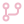
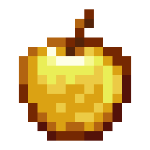

# rich_beluga

&nbsp;**I use Arch btw**

 

### &nbsp; Projects

- **Unium** — Rust mod manager (Ferium fork)
-  **Paper** plugins & **Fabric** mods
- **MCUB / Hikka** moderation & utility modules
 

### My socials

&nbsp;**Telegram:** [`@rich_beluga`](https://t.me/rich_beluga)

 